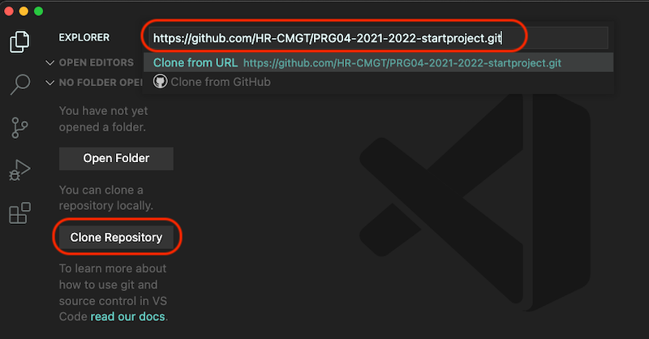
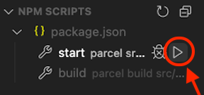

# CLE4
 
## Game: Pepperoni Party

Er is een pizzabodem op het midden van het scherm. De speler zal deze kunnen vullen met ingrediënten die op de rechterbalk staan. Dit zijn in het begin een paar ingrediënten om een Margherita te maken. Daarna worden er nieuwe ingrediënten ge-unlocked en zal de speler nog meer pizza's kunnen maken. Elke pizza die de speler correct maakt zal worden getoond in de "voltooide pizza-balk" aan de bovenkant van het scherm. Als de speler erg repetitief begint te worden en meermaals eenzelfde soort pizza maakt worden er acties zoals een specifiek ingrediënt gebruiken gelockt. Hierdoor wordt de speler geforceerd om een nieuw ingrediënt te gebruiken. Als de speler alle verschillende soorten pizza's heeft gemaakt dan kan de speler als laatst de Divine Pizza maken.

## Installeren

Open een nieuw VS Code venster. Ga naar **File > Clone Repository** en paste daar de `.git` url van dit project: `https://github.com/CurleyDS/CLE4.git`



In de VS Code terminal typ je:

```bash
npm install
```

In VS Code verschijnt een `start` button in de linkerbalk. Druk hierop om je game te **ontwikkelen**. Druk op `build` als je de game wil gaan **publiceren**.



Je kan die commando's ook in de terminal typen.

```bash
npm run start
npm run build
```
